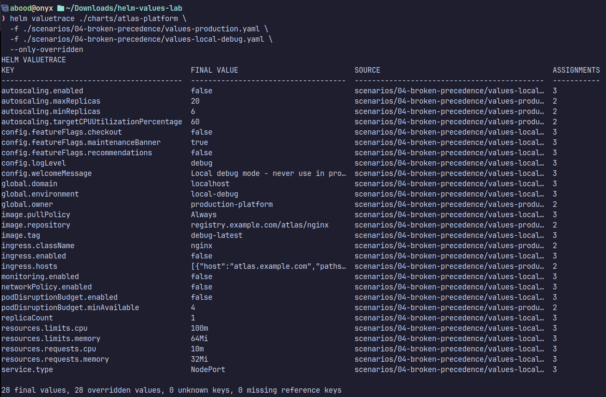
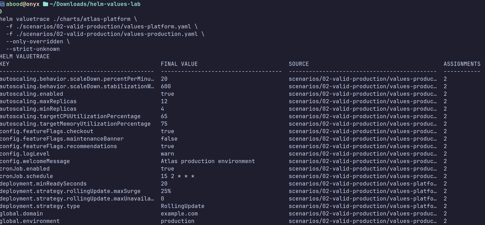
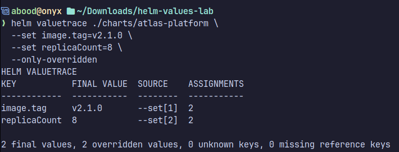
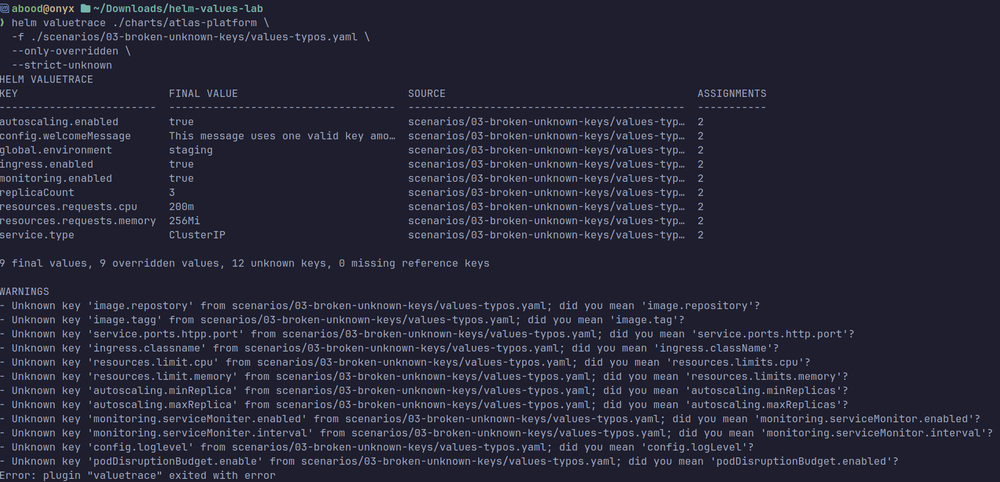
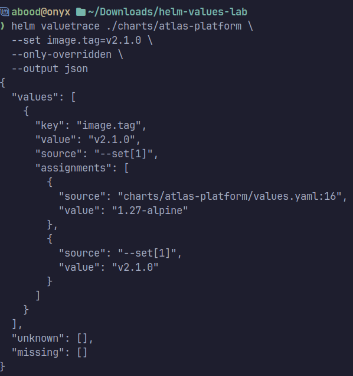

# Helm ValueTrace

> **Helm tells you what won. ValueTrace tells you where it came from.**

[](https://github.com/aboodcs/helm-valuetrace/releases) [](https://helm.sh/) [](https://www.python.org/) [](LICENSE) [](https://github.com/aboodcs/helm-valuetrace/actions/workflows/test.yaml)

**Before — a debug file silently wins because it is last:**
```bash
helm upgrade --install api ./chart -f ./values/production.yaml -f ./values/local-debug.yaml
```
**After — trace the same layers and block the debug source:**
```bash
helm valuetrace ./chart \
  -f ./values/production.yaml \
  -f ./values/local-debug.yaml \
  --only-overridden \
  --deny-source '*local-debug*'
```

Helm ValueTrace is a **local, read-only Helm plugin** that traces final values back to the file, YAML line, or `--set` argument that supplied them. It also detects unexpected keys, rejects forbidden values files, compares configurations with a reference structure, and can block unsafe CI paths.

The repository contains the plugin only. It does not include demo charts, training labs, Kubernetes manifests, or deployment scenarios.

## 30-second proof

```text
HELM VALUETRACE
KEY           FINAL VALUE  SOURCE                   ASSIGNMENTS
------------  -----------  -----------------------  -----------
image.tag     debug        values/local-debug.yaml:4 3
replicaCount  1            values/local-debug.yaml:8 3

WARNINGS
- Denied source 'values/local-debug.yaml' matched pattern '*local-debug*'
```

The report shows the winning value, its source, and how many times that key was assigned. With `--deny-source`, the same run exits with code `2` instead of allowing the configuration to continue through CI.



> All screenshots were captured from a local demo lab using `./charts/atlas-platform` and the `scenarios/` folder for illustration only; the lab is not included in this repository, so substitute your own chart and values files.

## Install

### Requirements

- Helm 3 or Helm 4
- Python 3.10+
- Python virtual-environment support
- Git
- Internet access during first installation

```bash
helm version
python3 --version
git --version
```

### Install from GitHub

```bash
git clone https://github.com/aboodcs/helm-valuetrace.git
cd helm-valuetrace
chmod +x install-local.sh uninstall-local.sh
./install-local.sh
```

`install-local.sh` copies the plugin into Helm's plugin directory, creates an isolated Python environment, installs dependencies from `requirements.txt`, and verifies that Helm can discover the plugin. It does not modify system Python.

Verify:

```bash
helm plugin list
helm valuetrace --version
helm valuetrace --help
```

Expected version:

```text
0.1.0
```

**Done.** ValueTrace is installed once and can be used with any local unpacked chart.

For development only, install dependencies manually:

```bash
python3 -m venv .env
source .env/bin/activate
python3 -m pip install --upgrade pip
python3 -m pip install -r requirements.txt
```

Uninstall:

```bash
helm plugin uninstall valuetrace
```

---

## Documentation

- [Usage](#usage)
- [Precedence and tracing](#precedence-and-tracing)
- [Validation](#validation)
- [Source policies](#source-policies)
- [Reference comparison](#reference-comparison)
- [Structured output](#structured-output)
- [CI/CD integration](#cicd-integration)
- [Command reference](#command-reference)
- [Exit codes](#exit-codes)
- [Safety and privacy](#safety-and-privacy)
- [Scope and limitations](#scope-and-limitations)
- [Troubleshooting](#troubleshooting)
- [Compatibility](#compatibility)
- [Development](#development)
- [Contributing](#contributing)
- [License](#license)

## Usage

The first argument must be a local unpacked Helm chart directory containing `Chart.yaml`.

```text
helm valuetrace CHART [options]
```

```bash
helm valuetrace ./chart

helm valuetrace ./chart \
  -f ./values/base.yaml \
  -f ./values/production.yaml

helm valuetrace ./chart \
  -f ./values/production.yaml \
  --set image.tag=v2.0.0 \
  --set replicaCount=5
```

A single `--set` may contain comma-separated assignments:

```bash
helm valuetrace ./chart --set image.tag=v2.0.0,replicaCount=5
```

For supported scalar values, `--set` uses Helm's typing rules. `true`, `false`,
`null`, and base-10 integers receive typed values; inputs such as `yes`, `0123`,
and `1.0` remain strings, just as they do in Helm.

Find chart roots in a repository:

```bash
find . -name Chart.yaml -printf '%h\n' | sort
```

`-f/--values` expects a YAML file, not a directory.

## Precedence and tracing

ValueTrace reports supported value sources in effective precedence order, from
lowest to highest:

1. `chart/values.yaml`
2. `-f/--values` files from left to right
3. `--set` arguments

Later assignments replace earlier scalar or list values; nested mappings merge.
Like Helm, ValueTrace first combines user-supplied values and then coalesces
unused chart defaults into the result. This preserves defaults correctly even
when successive files change a path from a map to a scalar and back to a map.

A user-supplied YAML or `--set` `null` removes a key that exists in chart
defaults. A null key that exists only in user values is preserved. Helm 4 removes
nulls declared only in chart defaults while Helm 3 preserves them; when invoked
as a plugin, ValueTrace detects the invoking Helm major version and follows that
behavior.

`--only-overridden` limits the table to keys assigned at least twice.

```bash
helm valuetrace ./chart \
  -f ./values/base.yaml \
  -f ./values/production.yaml \
  --only-overridden
```



Command-line overrides are traced as sources such as `--set[1]`:

```bash
helm valuetrace ./chart \
  --set image.tag=v2.1.0 \
  --set replicaCount=8 \
  --only-overridden
```



The default table columns are:

| Column | Meaning |
| --- | --- |
| `KEY` | Flattened YAML path, for example `image.repository`. |
| `FINAL VALUE` | Value remaining after supported layers are processed. |
| `SOURCE` | Winning file and YAML line, or `--set[n]`. |
| `ASSIGNMENTS` | Number of assignments recorded for the key. |

## Validation

Without `--reference-values`, known keys come from the chart's default `values.yaml`. With a reference file, known keys are the union of chart-default and reference keys.

Unexpected keys produce warnings and may receive similarity-based spelling suggestions:

```yaml
image:
  repostory: registry.example.com/api
```

```text
Unknown key 'image.repostory'; did you mean 'image.repository'?
```



Enable CI-blocking validation with:

```bash
helm valuetrace ./chart \
  -f ./values/production.yaml \
  --strict-unknown
```

`--strict-unknown` returns exit code `2` when an override file or `--set` introduces an unknown key. Suggestions are hints only; ValueTrace never rewrites configuration.

Empty mappings such as `podAnnotations: {}` are treated as extensible so free-form child keys do not create false warnings.

## Source policies

`--deny-source PATTERN` blocks a supplied `-f/--values` file by name or shell-style glob and returns exit code `2`. Quote glob patterns so the shell does not expand them before ValueTrace receives them.

Block one exact filename:

```bash
helm valuetrace ./chart \
  -f ./values/production.yaml \
  -f ./values/local-debug.yaml \
  --deny-source local-debug.yaml
```

Block a class of unsafe files:

```bash
helm valuetrace ./chart \
  -f ./values/production.yaml \
  -f ./values/local-debug.yaml \
  --deny-source '*local-debug*' \
  --deny-source '*secrets*'
```

Patterns are case-sensitive and are matched against the path as supplied, its resolved path, and its basename. The option is repeatable. Every supplied values file is checked, even when a later file replaces all of its values.

This policy checks source filenames, not whether their keys are structurally valid. A report can therefore contain `0 unknown keys` and still block a denied source:

```text
153 final values, 28 overridden values, 0 unknown keys, 0 missing reference keys, 1 denied source

WARNINGS
- Denied source 'values/local-debug.yaml' matched pattern '*local-debug*'
```

## Reference comparison

Use `--reference-values` when a chart has no useful default `values.yaml` or the team maintains a canonical allowed structure:

```bash
helm valuetrace ./chart \
  --reference-values ./values/reference.yaml \
  -f ./values/staging.yaml
```

The reference contributes **keys only**, not values. Keys present only in the analyzed configuration are `unknown`; reference keys absent from the analyzed result are `missing`.

To fail validation on either difference:

```bash
helm valuetrace ./chart \
  --reference-values ./values/reference.yaml \
  -f ./values/staging.yaml \
  --strict-reference
```

Reference comparison is structural: `unknown` does not mean Helm would reject a key, and `missing` does not mean the application requires it at runtime. Use a maintained, non-secret reference file.

## Structured output

Use `--output json` or `--output yaml` for automation:

```bash
helm valuetrace ./chart \
  -f ./values/production.yaml \
  --output json > valuetrace-report.json
```



Structured output has four top-level collections:

```json
{
  "values": [
    {
      "key": "image.tag",
      "value": "v2.0.0",
      "source": "--set[1]",
      "assignments": [
        {"source": "chart/values.yaml:5", "value": "stable"},
        {"source": "values-production.yaml:4", "value": "v1.9.0"},
        {"source": "--set[1]", "value": "v2.0.0"}
      ]
    }
  ],
  "unknown": [],
  "missing": [],
  "denied_sources": []
}
```

`values` contains final values, winning sources, and ordered assignment history. `unknown` contains unexpected keys plus an optional suggestion. `missing` contains reference keys absent from the analyzed result. `denied_sources` contains values files rejected by `--deny-source` and the pattern each one matched.

Warnings go to standard error; structured reports go to standard output.

## CI/CD integration

ValueTrace complements Helm's own checks:

```bash
helm lint ./chart -f ./values/production.yaml
helm valuetrace ./chart -f ./values/production.yaml \
  --strict-unknown --deny-source '*debug*'
helm template api ./chart -f ./values/production.yaml > rendered.yaml
```

| Command | Question answered |
| --- | --- |
| `helm lint` | Is the chart structurally valid according to Helm and its schema? |
| `helm valuetrace` | Which supported source produced each final value, and are keys expected? |
| `helm template` | Which Kubernetes manifests will Helm render? |
| `helm diff` | What would change compared with an existing release? |

ValueTrace does not replace linting, schema validation, rendering, diff, or dry-run workflows.

## Command reference

| Option | Behavior |
| --- | --- |
| `-f FILE`, `--values FILE` | Merge an override YAML file; repeatable. |
| `--set KEY=VALUE` | Apply dotted key overrides after values files; repeatable. |
| `--reference-values FILE` | Supply an allowed-key structure without merging its values. |
| `--strict-unknown` | Exit `2` when an override or `--set` contains an unknown key. |
| `--strict-reference` | Exit `2` when reference comparison finds unknown or missing keys. |
| `--deny-source PATTERN` | Exit `2` when a supplied `-f` file matches a filename or glob; repeatable. |
| `-o FORMAT`, `--output FORMAT` | `table`, `json`, or `yaml`; default `table`. |
| `--only-overridden` | Show only keys assigned at least twice. |
| `-h`, `--help` | Show help. |
| `--version` | Show installed version. |

```bash
helm valuetrace --help
```

## Exit codes

| Code | Meaning |
| ---: | --- |
| `0` | Analysis completed; no enabled strict validation failed. |
| `1` | Input/usage error: for example missing chart/file, invalid YAML, or invalid `--set`. |
| `2` | A validation check found structural issues or a source policy blocked a values file. |

For non-zero plugin exits, Helm may also print:

```text
Error: plugin "valuetrace" exited with error
```

In strict mode, that message can be the expected result of a blocked validation step.

## Safety and privacy

ValueTrace is local and read-only:

- It does not connect to the Kubernetes API or require `kubeconfig`.
- It does not install or upgrade releases.
- It does not modify charts or values files.
- It does not upload chart data externally.
- It does not write a report file unless output is redirected.

However, reports print final values. Passwords, tokens, registry credentials, private domains, or other sensitive data can therefore appear in terminal output, JSON/YAML reports, screenshots, or CI/CD logs.

**Do not publish reports containing secrets or proprietary configuration.**

## Scope and limitations

ValueTrace `v0.1.0` intentionally focuses on local Helm values tracing rather than reproducing all Helm behavior.

**Supported**

- Local unpacked chart directories
- Helm-style YAML map layering and default coalescing
- Nested mapping merges across repeated values files
- Later scalar/list replacement
- Dotted and comma-separated `--set` assignments
- Structural unknown-key validation and reference comparison
- Repeatable filename and glob policies for denied `-f` sources
- Helm-compatible scalar typing for supported `--set` values
- Version-aware Helm 3/4 YAML `null` behavior
- Extensible empty mappings

**Not supported in v0.1.0**

- Remote chart references or OCI chart URLs
- Packaged `.tgz` charts
- Template rendering or inspection of `.Values` paths used by templates
- `values.schema.json` validation
- Chart dependency loading
- Full subchart coalescing behavior
- Array-index expressions such as `servers[0].port`
- Escaped dots in `--set` key names
- Helm brace-list syntax such as `--set names={api,worker}`
- `--set-string`, `--set-file`, `--set-json`, or `--set-literal`
- Separate history for duplicate keys inside one YAML document

Unknown-key checks are structural, not template-aware. Reference comparison checks structure, not application business requirements.

For deployment truth, combine ValueTrace with Helm linting, schema validation, rendering, diff, and dry-run workflows.

## Troubleshooting

### Chart path errors

The chart directory must exist and contain `Chart.yaml`:

```bash
find . -name Chart.yaml -printf '%h\n' | sort
helm valuetrace ./returned/chart/path
```

### Values file not found

Pass a YAML file to `-f`, not a directory:

```bash
find . -type f \( -name 'values*.yaml' -o -name 'values*.yml' \) | sort
```

### Every key is unknown

If the chart has no `values.yaml`, provide a reference:

```bash
helm valuetrace ./chart \
  --reference-values ./values/reference.yaml \
  -f ./values/staging.yaml
```

### Strict mode prints a plugin error

Strict validation returns exit code `2`; Helm then prints its standard plugin failure message. This is expected when CI is intentionally blocked.

### Plugin breaks after deleting the source directory

If it was installed with development-mode behavior using `helm plugin install .`, reinstall from the repository with:

```bash
./install-local.sh
```

The included installer creates an independent permanent plugin copy.

## Compatibility

ValueTrace `v0.1.0` has been tested with:

- Helm 3.21.4 and Helm 4.2.4 through automated differential tests
- Python 3.10, 3.11, 3.12, and 3.13
- Linux plugin paths reported by `helm env HELM_PLUGINS`

Installation uses POSIX shell scripts; analysis uses Python 3.

## Development

ValueTrace was developed with AI-assisted tooling to accelerate implementation, testing, and documentation. Behavior was then validated through automated tests, failure scenarios, real plugin installations, Helm 3/4 differential tests, strict-mode exit-code checks, multi-environment inputs, unknown-key cases, precedence mistakes, null coalescing, scalar typing, and structured-output validation.

AI accelerated the implementation; the problem definition, supported behavior, limitations, and validation criteria remained explicit engineering decisions.

## Contributing

Issues and pull requests are welcome. Bug reports should include:

- Helm, Python, and ValueTrace versions
- Command used
- Minimal non-sensitive chart/values structure
- Actual and expected behavior

Do not include production secrets or proprietary configuration.

## License

Distributed under the [MIT License](LICENSE).

## Author

Abdulrehman Abulaban — [GitHub](https://github.com/aboodcs)

Current release: **v0.1.0**. See [CHANGELOG.md](CHANGELOG.md) for release history.
