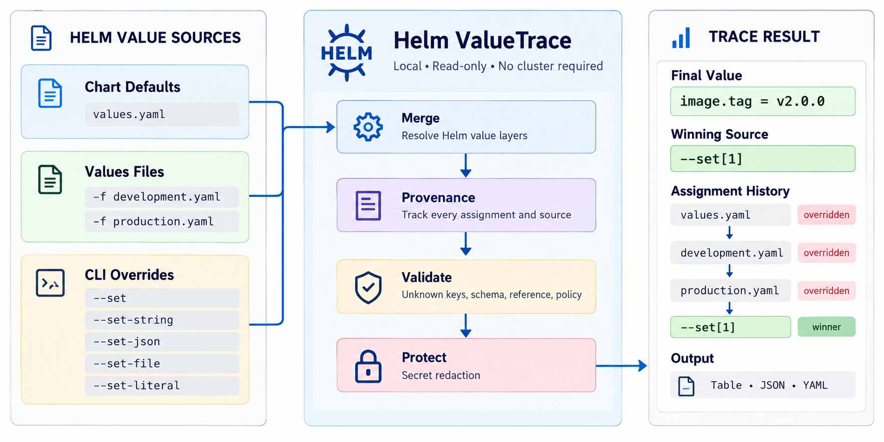
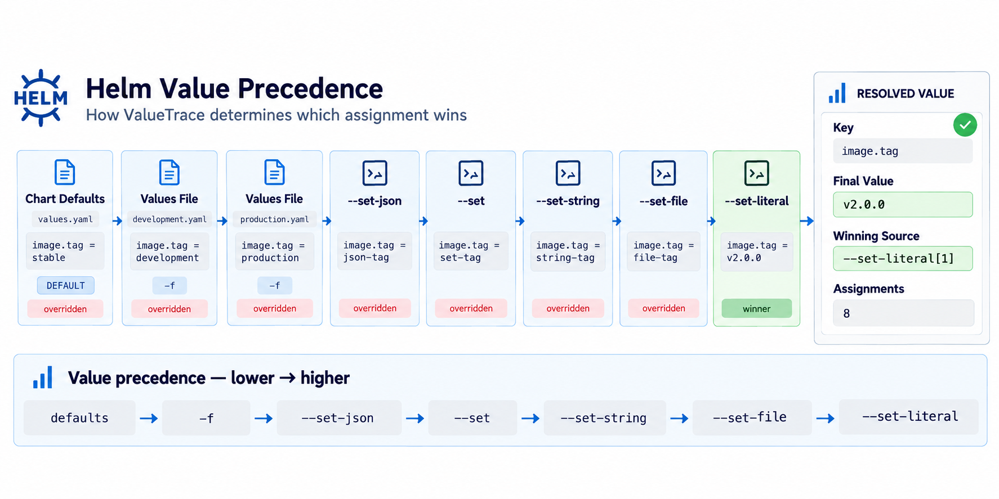
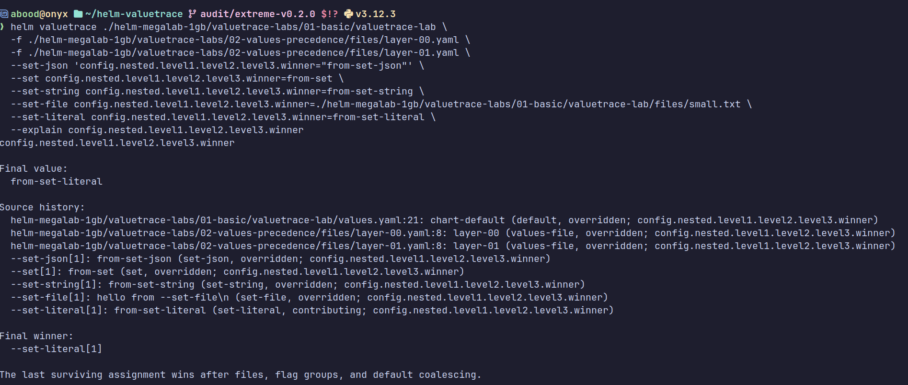
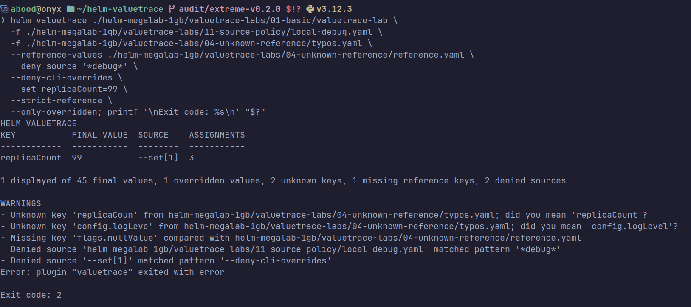
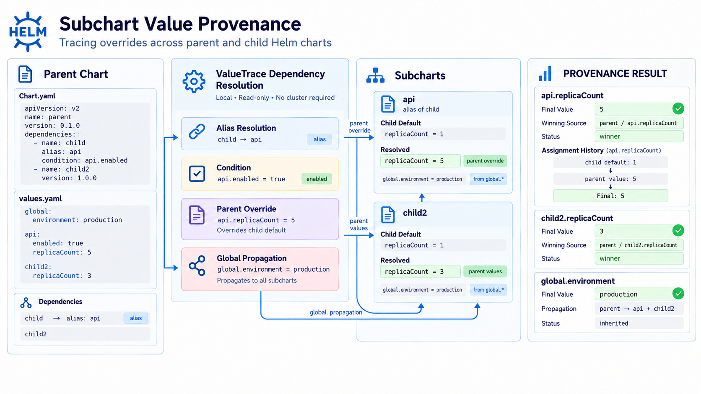
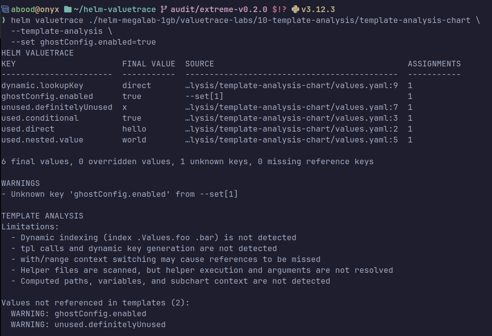

# Helm ValueTrace

> Trace exactly where every Helm value came from.

[](https://github.com/aboodcs/helm-valuetrace/releases)
[](https://helm.sh/)
[](https://www.python.org/)
[](LICENSE)
[](https://github.com/aboodcs/helm-valuetrace/actions/workflows/test.yaml)

Helm ValueTrace is a local, read-only debugging and auditing tool for Helm values. It shows the final value, the winning source, and the assignment history that produced it across chart defaults, `-f` values files, and `--set*` arguments.



---

## Why ValueTrace?

Helm values arrive from chart `values.yaml` defaults, multiple environment `-f` files, and CI `--set*` arguments. Later sources silently overwrite earlier settings. Native `helm template` outputs only final Kubernetes manifests, while `helm get values` displays only raw user inputs. Neither command identifies which file or argument set `replicaCount` or toggled an ingress setting. ValueTrace makes resolution transparent and auditable before deployment.

---

## Installation

Requirements: Helm 3 or 4, Python 3.10+, Git.

```bash
# Helm 4
helm plugin install https://github.com/aboodcs/helm-valuetrace --verify=false

# Helm 3
helm plugin install https://github.com/aboodcs/helm-valuetrace

# Verify installation
helm valuetrace --version
# Output: Helm ValueTrace 0.2.0
```

> Helm 4 enables plugin source verification by default. When installing directly from the Git repository, use `--verify=false`.

### From Local Checkout

```bash
git clone https://github.com/aboodcs/helm-valuetrace.git
cd helm-valuetrace
./install-local.sh
```

For air-gapped environments: download wheels with `pip download -r requirements.txt -d wheelhouse`, transfer them, and run `PIP_NO_INDEX=1 PIP_FIND_LINKS=wheelhouse ./install-local.sh`.

To uninstall: `helm plugin uninstall valuetrace` (or `./uninstall-local.sh`).

---

## Quick Start

These examples use the sample chart in this repository. Clone the repo to follow along.

Trace a chart's default values:

```bash
helm valuetrace ./examples/layered/chart
```

Trace layered values files and command-line overrides:

```bash
helm valuetrace ./examples/layered/chart \
  -f ./examples/layered/development.yaml \
  -f ./examples/layered/production.yaml \
  --set image.tag=v2.0.0
```

```text
HELM VALUETRACE
KEY                   FINAL VALUE                           SOURCE                                 ASSIGNMENTS
--------------------  ------------------------------------  -------------------------------------  -----------
credentials.password  <redacted>                            examples/layered/production.yaml:5     3
image.repository      nginx                                 examples/layered/chart/values.yaml:3   1
image.tag             v2.0.0                                --set[1]                               4
replicaCount          4                                     examples/layered/production.yaml:1     3
service.port          80                                    examples/layered/chart/values.yaml:6   1
service.type          LoadBalancer                          examples/layered/development.yaml:5    2
users                 [{"name":"demo","token":"<redacted>…  examples/layered/chart/values.yaml:11  1
```

---

## Core Features

- **Exact value provenance:** Trace every key back to its source file and YAML line number or CLI argument.
- **Override history:** Filter to overridden keys with `--only-overridden`, then inspect history with `--explain`.
- **Helm-compatible `--set*` support:** Accurately parses `--set`, `--set-string`, `--set-json`, `--set-file`, and `--set-literal`.
- **Unknown-key detection:** Catch misspelled keys with similarity-based hints before deploying.
- **Schema validation:** Validate against `values.schema.json` with strict failure modes (`--strict-schema`).
- **Automatic secret redaction:** Passwords, tokens, and credentials are automatically masked in all outputs by default.
- **Structured output:** Export results to human-readable `table`, automation-ready `json`, or structured `yaml`.
- **Policy enforcement:** Block unauthorized debug files (`--deny-source`) or CLI overrides (`--deny-cli-overrides`) in CI.

---

## Value Precedence

ValueTrace uses Helm's value precedence order (lowest to highest):

```text
Chart defaults (values.yaml)
      ↓
-f values files (left to right)
      ↓
--set-json
      ↓
--set
      ↓
--set-string
      ↓
--set-file
      ↓
--set-literal
```

User layers are evaluated first, after which chart defaults coalesce into any unassigned paths.



---

## Explain Mode

Use `--explain KEY` to inspect a key's winning source and complete assignment history:

```bash
helm valuetrace ./examples/layered/chart \
  -f ./examples/layered/development.yaml \
  -f ./examples/layered/production.yaml \
  --set image.tag=v2.0.0 \
  --explain image.tag
```

```text
image.tag

Final value:
  v2.0.0

Source history:
  examples/layered/chart/values.yaml:4: stable (default, overridden; image.tag)
  examples/layered/development.yaml:3: development (values-file, overridden; image.tag)
  examples/layered/production.yaml:3: production (values-file, overridden; image.tag)
  --set[1]: v2.0.0 (set, contributing; image.tag)

Final winner:
  --set[1]
```



---

## CLI Overrides

ValueTrace models Helm's command-line override options:

| Flag | Purpose |
| --- | --- |
| `--set KEY=VALUE` | Standard typed override with scalar coercion (`true`, `123`, `null`) |
| `--set-string KEY=VALUE` | Force value to be treated strictly as a string |
| `--set-json KEY=JSON` | Parse value as JSON (objects, arrays, numbers, booleans) |
| `--set-file KEY=PATH` | Set key to the contents of a local file as a string |
| `--set-literal KEY=VALUE` | Preserve literal string value without comma or escape splitting |

---

## Validation & Policy Enforcement

Enforce configuration correctness and block dangerous patterns in CI:

- **`--strict-unknown`**: Exits with code `2` if values files declare keys absent from defaults or schema. Suggests corrections for typos (e.g. `image.repostory` &rarr; `image.repository`).
- **`--strict-schema`**: Exits with code `2` if values fail `values.schema.json` validation (default: warn only).
- **`--reference-values FILE`**: Compare against a canonical key structure without merging its values (use `--strict-reference` to exit `2` on discrepancies).
- **`--deny-source PATTERN`**: Exits with code `2` if a `-f` file matches a name or glob pattern (e.g. `'*local-debug*'`).
- **`--deny-cli-overrides`**: Exits with code `2` if any `--set*` flag is supplied, enforcing pure file-driven GitOps.



---

## Secret Redaction

**Secret redaction is enabled by default.**

Keys matching sensitive names (`password`, `token`, `secret`, `api_key`, `credentials`) are masked as `<redacted>` in table, JSON, YAML, and explain modes:

```text
KEY                   FINAL VALUE
credentials.password  <redacted>
users[0].token        <redacted>
```

- `--redact-path PATH`: Redact specific exact paths and their children.
- `--redact-pattern PATTERN`: Add custom glob patterns for sensitive key names.
- `--no-redact`: Disable redaction to reveal plaintext values.

> Automatic redaction is heuristic and should not be treated as a guarantee that every possible secret will be detected. Always review reports before sharing.

---

## Output Formats

ValueTrace supports three output formats (default: `table`):

```bash
helm valuetrace ./examples/layered/chart -o json > report.json
helm valuetrace ./examples/layered/chart -o yaml > report.yaml
```

JSON and YAML outputs include final values, typed paths, contributing sources, and ordered assignment histories for automated CI/CD tooling.

---

## Common Examples

```bash
# 1. Trace chart defaults
helm valuetrace ./examples/layered/chart

# 2. Trace multiple values files and filter to overridden keys
helm valuetrace ./examples/layered/chart -f ./examples/layered/development.yaml -f ./examples/layered/production.yaml --only-overridden

# 3. Deep-dive into a single key's assignment history
helm valuetrace ./examples/layered/chart -f ./examples/layered/production.yaml --explain image.tag

# 4. Fail CI on unexpected keys or schema violations
helm valuetrace ./examples/layered/chart -f ./examples/layered/production.yaml --strict-schema --strict-unknown

# 5. Block debug values files from production deployments
helm valuetrace ./examples/layered/chart \
  -f ./examples/layered/development.yaml \
  -f ./examples/layered/production.yaml \
  --deny-source '*development*'
```

See [examples/layered](examples/layered/README.md) for a cluster-free, multi-environment walkthrough.

---

## Exit Codes

ValueTrace returns deterministic exit codes for CI/CD automation:

| Code | Meaning |
| ---: | --- |
| `0` | Success: analysis completed; all enabled validations passed |
| `1` | Usage / input error: invalid arguments, missing file, syntax error |
| `2` | Validation / policy violation: unknown keys, schema failure, denied source |
| `3` | Chart / dependency error: missing `Chart.yaml`, corrupt archive |
| `4` | Internal error: unexpected runtime exception |

---

## Scope & Limitations

- **Local charts only:** Analyzes local chart directories and `.tgz` archives; does not fetch from remote HTTP or OCI registries.
- **Client-side only:** Runs entirely locally without connecting to a Kubernetes cluster or reading a `kubeconfig`.
- **Static template analysis:** `--template-analysis` statically scans `.Values.*` references; it does not evaluate dynamic template logic (`tpl`, `range`, `include`).
- **Experimental subcharts:** `--experimental-subcharts` discovers local subcharts in `charts/`; dynamic repository downloads and complex coalescing permutations are outside the verified boundary.





---

## Troubleshooting

### Python version is too old

ValueTrace requires Python 3.10+. If `python3 --version` is 3.9 or older, install Python 3.10+ or run ValueTrace in a supported virtual environment.

### Plugin installed but command is unavailable

Ensure the plugin directory is detected by Helm:

```bash
helm plugin list
helm valuetrace --version
```

If missing, reinstall using `./install-local.sh`.

### Chart directory error

ValueTrace requires a local chart directory or packaged archive containing `Chart.yaml`. Verify that the specified path points directly to the chart root.

---

## Development

```bash
python3 -m venv .venv
source .venv/bin/activate
pip install -e '.[dev]'
pytest
ruff check .
ruff format --check .
```

---

## Contributing

Issues and pull requests are welcome on [GitHub](https://github.com/aboodcs/helm-valuetrace). Please ensure changes include tests and pass `ruff check .`.

---

## License

Distributed under the [MIT License](LICENSE).
